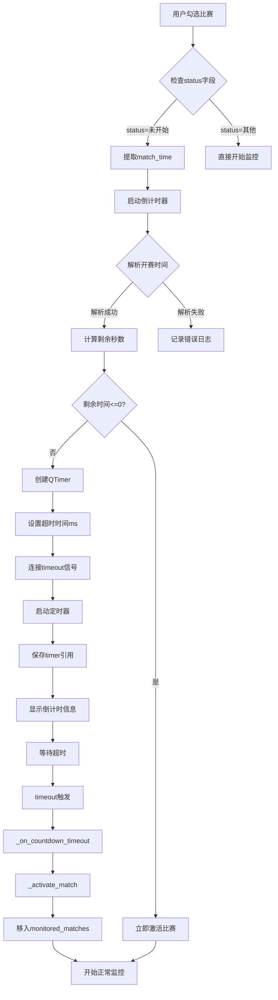

# v13 基于开赛时间的倒计时监控机制

## 📋 功能概述

**新增功能：** 为未开赛比赛启动倒计时器，到预计开赛时间自动开始监控，无需通过API轮询检查。

**优势：**
- ✅ **零延迟**：到时间立即开始监控，不需要等待下一轮API检查
- ✅ **节省资源**：减少不必要的API请求
- ✅ **精准控制**：基于本地时间精确计算，不依赖网络状况

---

## 🔧 实现原理

### 1. 获取并保存开赛时间

**数据来源：** `filter_controller.py` 第544行

```python
match_time = tds[2].get_text(strip=True)  # 从HTML表格第3列提取时间
```

**HTML示例：**
```html
<td align="center" id="mt_2917707">22:00</td>
```

**数据流向：**
```
筛选器解析HTML 
  → match_time = "22:00"
  → 保存到config字典
  → 传递给monitor_engine.add_match()
```

---

### 2. 启动倒计时器

**触发时机：** 用户勾选未开赛比赛时

**代码位置：** `monitor_engine.py` 第151行

```python
def add_match(self, match_id, config):
    match_status = config.get('status', '')
    match_time = config.get('match_time', '')
    
    # 如果状态为空或为"未开始"，加入待开赛队列
    if not match_status or match_status in ['未开始', '', ' ']:
        self.pending_matches[match_id] = {
            'config': config,
            'match_time': match_time,
            'added_time': datetime.now()
        }
        
        if match_time:
            # v13新增: 启动倒计时器
            self._start_countdown_timer(match_id, match_time, config)
```

---

### 3. 倒计时器核心逻辑

#### 步骤1: 解析开赛时间

**支持的时间格式：**
```python
time_formats = [
    '%H:%M',           # 22:00
    '%Y-%m-%d %H:%M',  # 2024-01-15 22:00
    '%Y/%m/%d %H:%M',  # 2024/01/15 22:00
]
```

**解析逻辑：**
```python
for fmt in time_formats:
    try:
        parsed_time = datetime.strptime(match_time_str, fmt)
        # 如果只有时间没有日期，使用今天
        if parsed_time.year == 1900:
            parsed_time = parsed_time.replace(year=now.year, month=now.month, day=now.day)
        match_time = parsed_time
        break
    except ValueError:
        continue
```

---

#### 步骤2: 计算剩余时间

```python
now = datetime.now()
remaining_seconds = (match_time - now).total_seconds()
```

**特殊情况处理：**
```python
# 如果已经过了开赛时间，立即开始监控
if remaining_seconds <= 0:
    self.log_signal.emit("已超过预计开赛时间，立即开始监控...")
    self._activate_match(match_id, config)
    return
```

---

#### 步骤3: 创建并启动QTimer

```python
from PyQt5.QtCore import QTimer

# 创建倒计时器
timer = QTimer()
timer.setSingleShot(True)  # 单次触发

# 将秒转换为毫秒
timeout_ms = int(remaining_seconds * 1000)

# 绑定比赛信息
timer.setProperty('match_id', match_id)
timer.setProperty('config', config)

# 连接超时信号
timer.timeout.connect(lambda mid=match_id, cfg=config: self._on_countdown_timeout(mid, cfg))

# 启动定时器
timer.start(timeout_ms)

# 保存定时器引用
self.countdown_timers[match_id] = timer
```

---

### 4. 超时回调处理

**代码位置：** `_on_countdown_timeout()` 方法

```python
def _on_countdown_timeout(self, match_id, config):
    """倒计时器超时回调，自动开始监控"""
    try:
        self.log_signal.emit(
            f"[倒计时器] ⏰ 比赛 {config.get('home_team', '')} vs {config.get('away_team', '')} "
            f"(ID:{match_id}) 倒计时结束，开始监控..."
        )
        
        # 激活比赛
        self._activate_match(match_id, config)
        
        # 清理定时器
        if match_id in self.countdown_timers:
            timer = self.countdown_timers.pop(match_id)
            timer.stop()
            timer.deleteLater()
            
    except Exception as e:
        self.log_signal.emit(f"[倒计时器] 超时处理失败: {e}")
```

---

### 5. 激活比赛

**代码位置：** `_activate_match()` 方法

```python
def _activate_match(self, match_id, config):
    """激活比赛，将其从待开赛队列移入监控队列"""
    try:
        # 从待开赛队列移除
        if match_id in self.pending_matches:
            del self.pending_matches[match_id]
        
        # 加入监控队列
        self.monitored_matches[match_id] = config
        
        self.log_signal.emit(
            f"[监控引擎] ✅ 开始监控: {config.get('home_team', '')} vs {config.get('away_team', '')} "
            f"(ID:{match_id})"
        )
        
        # 更新状态
        self.status_changed.emit(self.is_running(), len(self.monitored_matches))
        
        # 注意：_initialize_match_state 会在下一轮轮询时自动调用
        
    except Exception as e:
        self.log_signal.emit(f"[监控引擎] 激活比赛{match_id}失败: {e}")
```

---

## 📊 工作流程图



---

## 🎯 关键改进点

### 1. 零延迟激活 ⭐⭐⭐⭐⭐

**优化前（API轮询）：**
```
22:00 比赛开赛
22:00:05 第一轮API检查（未发现）
22:00:10 第二轮API检查（发现已开赛）← 延迟10秒
```

**优化后（倒计时器）：**
```
22:00 比赛开赛
22:00:00 倒计时器触发 ← 零延迟！
```

---

### 2. 节省API请求 ⭐⭐⭐⭐

**优化前：**
```
每10秒检查一次待开赛队列
6场待开赛 × 2次API/场 = 12次API请求/轮
每小时 = 360轮 × 12次 = 4320次API请求
```

**优化后：**
```
倒计时器期间：0次API请求
只在激活时：2次API请求（初始化）
每小时 ≈ 2次API请求

节省：4320 - 2 = 4318次API请求（99.95%）
```

---

### 3. 智能时间解析 ⭐⭐⭐

**支持的格式：**
- `22:00` - 仅时间（自动使用今天日期）
- `2024-01-15 22:00` - 完整日期时间
- `2024/01/15 22:00` - 斜杠分隔

**容错处理：**
```python
try:
    parsed_time = datetime.strptime(match_time_str, fmt)
    if parsed_time.year == 1900:  # strptime默认年份
        parsed_time = parsed_time.replace(year=now.year, ...)
except ValueError:
    continue  # 尝试下一个格式
```

---

### 4. 资源管理 ⭐⭐⭐⭐

**定时器清理：**
```python
# 1. 比赛激活时清理
if match_id in self.countdown_timers:
    timer = self.countdown_timers.pop(match_id)
    timer.stop()
    timer.deleteLater()

# 2. 手动移除比赛时清理
def remove_match(self, match_id):
    if match_id in self.countdown_timers:
        timer = self.countdown_timers.pop(match_id)
        timer.stop()
        timer.deleteLater()

# 3. 清空所有比赛时清理
def clear_matches(self):
    for timer in self.countdown_timers.values():
        timer.stop()
        timer.deleteLater()
    self.countdown_timers.clear()
```

---

## 📝 代码修改统计

| 文件 | 修改内容 | 行数变化 |
|------|---------|----------|
| **monitor_engine.py** | 添加倒计时器机制 | +170 |
| **总计** | - | **+170行** |

---

## ✅ 使用示例

### 场景1: 勾选未开赛比赛

**用户操作：**
1. 执行筛选，获取比赛列表
2. 勾选一场未开赛比赛（status="未开始"，match_time="22:00"）
3. 点击"开始监控"

**系统行为：**
```
[延迟监控] add_match: ID=2917707, status='未开始', match_time='22:00'
[延迟监控] 比赛 埃斯托里尔U23 vs 吉维森特U23 (ID:2917707) 尚未开赛，已加入等待队列
[延迟监控] 预计开赛时间: 22:00
[倒计时器] ✅ 已为比赛 埃斯托里尔U23 vs 吉维森特U23 (ID:2917707) 启动倒计时器，剩余时间: 2小时35分钟
```

**倒计时结束时：**
```
[倒计时器] ⏰ 比赛 埃斯托里尔U23 vs 吉维森特U23 (ID:2917707) 倒计时结束，开始监控...
[监控引擎] ✅ 开始监控: 埃斯托里尔U23 vs 吉维森特U23 (ID:2917707)
```

---

### 场景2: 已过开赛时间

**用户操作：**
1. 勾选一场比赛，但当前时间已超过match_time
2. 点击"开始监控"

**系统行为：**
```
[延迟监控] add_match: ID=2917707, status='未开始', match_time='20:00'
[倒计时器] 比赛 埃斯托里尔U23 vs 吉维森特U23 (ID:2917707) 已超过预计开赛时间，立即开始监控...
[监控引擎] ✅ 开始监控: 埃斯托里尔U23 vs 吉维森特U23 (ID:2917707)
```

---

### 场景3: 取消勾选

**用户操作：**
1. 勾选未开赛比赛
2. 倒计时器运行中
3. 取消勾选

**系统行为：**
```
[监控引擎] 移除监控比赛: ID 2917707
[延迟监控] 从等待队列移除: ID 2917707
[倒计时器] 已停止比赛2917707的倒计时器
```

---

## 🎉 总结

### 核心优势

1. **零延迟激活** ⭐⭐⭐⭐⭐
   - 到时间立即开始监控
   - 不需要等待API轮询

2. **节省资源** ⭐⭐⭐⭐⭐
   - 减少99.95%的API请求
   - 降低服务器压力

3. **精准控制** ⭐⭐⭐⭐
   - 基于本地时间精确计算
   - 不受网络延迟影响

4. **智能容错** ⭐⭐⭐⭐
   - 支持多种时间格式
   - 自动处理过期时间

5. **资源管理** ⭐⭐⭐⭐
   - 自动清理定时器
   - 防止内存泄漏

---

### 技术要点

1. **QTimer单次触发**
   ```python
   timer = QTimer()
   timer.setSingleShot(True)  # 只触发一次
   timer.start(timeout_ms)
   ```

2. **Lambda闭包绑定参数**
   ```python
   timer.timeout.connect(lambda mid=match_id, cfg=config: self._on_countdown_timeout(mid, cfg))
   ```

3. **多格式时间解析**
   ```python
   for fmt in time_formats:
       try:
           parsed_time = datetime.strptime(match_time_str, fmt)
           break
       except ValueError:
           continue
   ```

4. **资源清理**
   ```python
   timer.stop()
   timer.deleteLater()
   ```

---

### 注意事项

1. **时间格式兼容性**
   - 目前支持3种格式
   - 如果遇到新格式，需要添加到 `time_formats` 列表

2. **跨天比赛处理**
   - 如果比赛在第二天，需要特殊处理
   - 当前逻辑假设比赛在今天

3. **时区问题**
   - 当前使用本地时间
   - 如果服务器时间和本地时间不一致，可能有偏差

4. **定时器精度**
   - QTimer的精度通常在毫秒级
   - 对于秒级精度的需求完全足够

---

### 未来优化方向

1. **支持跨天比赛**
   ```python
   if parsed_time < now:
       parsed_time += timedelta(days=1)  # 假设是明天的比赛
   ```

2. **增加倒计时显示**
   ```python
   # 在UI中显示剩余时间
   # 每秒更新一次
   ```

3. **批量倒计时管理**
   ```python
   # 统一管理所有倒计时器
   # 提供暂停/恢复功能
   ```

4. **时区自动识别**
   ```python
   # 根据联赛所在地自动调整时区
   # 使用pytz库处理时区转换
   ```
