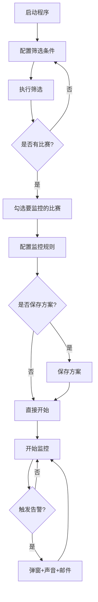

# 盘口监控邮件提醒系统 v2.0 使用说明

## 📖 目录

- [系统简介](#系统简介)
- [快速开始](#快速开始)
- [界面概览](#界面概览)
- [使用流程](#使用流程)
- [控件详解](#控件详解)
- [高级功能](#高级功能)
- [常见问题](#常见问题)

---

## 系统简介

**盘口监控邮件提醒系统**是一款专业的足球比赛盘口实时监控工具，能够：

✅ **智能筛选**: 按亚盘/大小球初盘条件筛选比赛  
✅ **实时监控**: 自动获取最新盘口水位和比分数据  
✅ **多规则告警**: 支持进球、水位、盘口变化等多种提醒规则  
✅ **多渠道通知**: 弹窗、声音、邮件三重提醒  
✅ **方案管理**: 保存和加载常用配置，一键应用  
✅ **高分屏适配**: 完美支持2736×1824等高分辨率屏幕  

---

## 快速开始

### 1. 环境准备

```bash
# 安装依赖
pip install PyQt5 requests beautifulsoup4

# 确保Python版本 >= 3.7
python --version
```

### 2. 启动程序

```bash
cd v2
python 盘口监控邮件提醒.py
```

### 3. 首次使用

1. **配置邮箱**（可选）: 右侧面板 → 邮件设置
2. **设置筛选条件**: 左侧面板 → 选择盘口
3. **执行筛选**: 点击"🔍 执行筛选"
4. **勾选比赛**: 在表格中勾选要监控的比赛
5. **配置规则**: 在下方卡片中设置监控规则
6. **开始监控**: 点击顶部"▶ 开始监控"

---

## 界面概览

```
┌─────────────────────────────────────────────────────────────────────┐
│ ⚽ 盘口监控与邮件提醒    ● 就绪  监控中: 3场  告警: 5次              │
│                              📋 方案:[▼] [📥加载] [💾保存] [🗑️删除]  │
│                                              [▶ 开始监控] [⏹ 停止]   │
├──────────┬──────────────────────────────────────────┬───────────────┤
│          │                                          │               │
│ 左侧     │           中间                           │    右侧       │
│ 筛选面板 │         比赛数据区                        │   设置面板    │
│          │                                          │               │
│ 📊 亚盘  │  ┌───┬────┬──────┬────┬────┬────┬───┐  │ ⚙️ 监控设置   │
│ ☑ 启用   │  │ ✓ │时间│对阵  │比分│状态│... │   │  │               │
│ □ 平手   │  ├───┼────┼──────┼────┼────┼────┼───┤  │ 📧 邮件设置   │
│ □ 平/半  │  │☑  │14:3│A vs B│2-1 │70' │... │   │  │               │
│ ☑ 半球   │  │☑  │15:0│C vs D│0-0 │45' │... │   │  │ 📝 运行日志   │
│ ...      │  └───┴────┴──────┴────┴────┴────┴───┘  │               │
│          │                                          │               │
│ 📊 大小球│  ┌──────────────────────────────────┐  │               │
│ ☑ 启用   │  │ ⚽ 进球提醒                       │  │               │
│ □ 2球    │  │ [□] 全场目标: [0球]              │  │               │
│ ☑ 2.5球  │  │ [□] 上半场进球 阈值:[1球]        │  │               │
│ ☑ 3球    │  │ [□] 下半场进球 阈值:[1球]        │  │               │
│ ...      │  └──────────────────────────────────┘  │               │
│          │  ┌──────────────────────────────────┐  │               │
│          │  │ ⏱️ 时间节点提醒                   │  │               │
│          │  │ [□] 上半场无进球 [30分钟]        │  │               │
│          │  │ [□] 下半场无进球 [70分钟]        │  │               │
│          │  └──────────────────────────────────┘  │               │
│          │  ┌──────────────────────────────────┐  │               │
│          │  │ 📊 亚盘/大小球水位                │  │               │
│          │  │ [□] 亚盘主队水位 [<] [0.85]      │  │               │
│          │  │ ...                              │  │               │
│          │  └──────────────────────────────────┘  │               │
└──────────┴──────────────────────────────────────────┴───────────────┘
```

---

## 使用流程

### 完整工作流程



### 步骤详解

#### 步骤1: 设置筛选条件

**左侧面板 - 亚盘初盘筛选**
1. 勾选"启用亚盘筛选"
2. 从列表中选择要监控的盘口类型
   - 例如: 勾选"半球"、"半/一"等

**左侧面板 - 大小球初盘筛选**
1. 勾选"启用大小球筛选"
2. 从列表中选择要监控的大小球盘口
   - 例如: 勾选"2.5球"、"3球"等

**提示**: 
- 至少选择一个盘口条件
- 可以同时选择多个盘口
- 筛选结果 = 亚盘条件 OR 大小球条件

---

#### 步骤2: 执行筛选

1. 点击左侧底部的 **"🔍 执行筛选"** 按钮
2. 等待筛选完成（通常5-15秒）
3. 查看中间表格中的筛选结果

**筛选过程**:
- 第1阶段: 获取当天比赛列表
- 第2阶段: 并发获取亚盘初盘
- 第3阶段: 并发获取大小球初盘
- 第4阶段: 获取半场初盘数据
- 第5阶段: 过滤符合条件的比赛

---

#### 步骤3: 选择监控比赛

在中间的表格中：
1. 查看筛选出的比赛列表
2. 点击每行第一列的复选框 (✓)
3. 勾选想要监控的比赛

**表格列说明**:
- ✓ : 复选框，勾选后加入监控
- 时间: 比赛日期和时间
- 对阵: 主队 vs 客队
- 比分: 当前比分
- 状态: 比赛状态（未开始/进行中/已结束）
- 亚盘初盘: 亚盘初始盘口
- 大小球初盘: 大小球初始盘口
- 半场亚盘: 半场亚盘初盘
- 半场大小球: 半场大小球初盘
- 来源: 数据来源标识
- 实时水位: 最新水位和更新时间

---

#### 步骤4: 配置监控规则

**勾选比赛后，表格下方会出现该比赛的配置卡片**

##### 4.1 进球提醒

**全场目标进球**
- 勾选启用
- 设置目标进球数（0-15球）
- 当全场进球达到设定值时提醒

**上半场进球（带阈值）**
- 勾选启用
- 设置进球阈值（1-10球）
- 当上半场进球**达到阈值**时提醒
- 示例: 阈值设为2，上半场进2球时提醒

**下半场进球（带阈值）**
- 勾选启用
- 设置进球阈值（1-10球）
- 当下半场进球**达到阈值**时提醒

---

##### 4.2 时间节点提醒

**上半场无进球**
- 勾选启用
- 设置检测时间（20-45分钟）
- 默认: 30分钟
- 当上半场到设定时间仍无进球时提醒

**下半场无进球**
- 勾选启用
- 设置检测时间（50-85分钟）
- 默认: 70分钟
- 当下半场到设定时间仍无进球时提醒

---

##### 4.3 水位监控

**亚盘主队水位**
- 勾选启用
- 选择比较符: < (低于) / > (高于) / = (等于)
- 设置阈值: 0.00-9.99
- 示例: [<] [0.85] = 主队水位≤0.85时提醒

**亚盘客队水位**
- 同上，针对客队

**大球水位**
- 勾选启用
- 设置比较符和阈值
- 大球水位触发条件时提醒

**小球水位**
- 同上，针对小球

---

##### 4.4 盘口变化监控

**亚盘盘口变化**
- 勾选启用
- 设置变化阈值（如0.25）
- 选择比较符
- 当盘口变化幅度超过阈值时提醒
- 示例: 从半球升到半一，变化0.25

**大小球盘口变化**
- 同上，针对大小球盘口

---

#### 步骤5: 保存方案（可选）

如果配置了一套常用的监控规则，可以保存为方案：

1. 确保已选中一个比赛
2. 点击顶部工具栏的 **"💾 保存"** 按钮
3. 输入方案名称（如"激进型监控"）
4. 点击确定

**方案管理**:
- **加载方案**: 选择方案 → 点击"📥 加载" → 应用到当前比赛
- **删除方案**: 选择方案 → 点击"🗑️ 删除" → 确认删除

**典型方案示例**:

| 方案名 | 适用场景 | 配置特点 |
|--------|---------|---------|
| 激进型 | 关注所有进球 | 上下半场阈值1球，无进球25/65分钟 |
| 保守型 | 只关注重要进球 | 上下半场阈值2-3球，无进球75分钟 |
| 高比分 | 大球比赛 | 全场目标5球，上下半场阈值2-3球 |
| 沉闷型 | 关注无进球 | 只启用无进球提醒30/70分钟 |

---

#### 步骤6: 开始监控

1. 配置完所有比赛的规则后
2. 点击顶部工具栏的 **"▶ 开始监控"** 按钮
3. 系统开始自动轮询（默认10秒一次）
4. 观察右侧日志区的实时日志

**监控状态**:
- ● 就绪: 未开始监控
- ● 运行中: 正在监控
- 监控中: X场: 当前监控的比赛数量
- 告警: X次: 触发的告警次数

---

#### 步骤7: 接收告警

当触发告警规则时，系统会通过以下方式通知：

**1. 弹窗提醒**
- 弹出警告窗口
- 显示详细的告警信息
- 需要手动点击"确定"关闭

**2. 声音报警**
- 播放系统提示音
- 不同类型告警声音不同
- 进球提醒: 2声短促
- 水位告警: 4声急促蜂鸣

**3. 邮件通知**（需配置）
- 发送SMTP邮件
- 包含完整的告警信息
- 适合远程监控

**4. 日志记录**
- 自动保存到 `alert_logs/` 目录
- JSON格式，按日期分文件
- 方便后续查询和分析

---

## 控件详解

### 顶部工具栏

| 控件 | 作用 | 说明 |
|------|------|------|
| ⚽ 标题 | 显示程序名称 | - |
| ● 状态指示 | 显示运行状态 | 绿色=就绪，红色=运行中 |
| 监控中: X场 | 显示监控数量 | 实时更新 |
| 告警: X次 | 显示告警次数 | 累计计数 |
| 📋 方案下拉框 | 选择监控方案 | 保存的配置列表 |
| 📥 加载 | 加载方案到当前比赛 | 应用方案的配置 |
| 💾 保存 | 保存当前配置为方案 | 输入方案名称 |
| 🗑️ 删除 | 删除选中的方案 | 需二次确认 |
| ▶ 开始监控 | 启动监控引擎 | 开始轮询数据 |
| ⏹ 停止监控 | 停止监控 | 停止轮询 |

---

### 左侧筛选面板

#### 亚盘初盘筛选

| 控件 | 作用 | 选项 |
|------|------|------|
| 启用复选框 | 开启/关闭亚盘筛选 | - |
| 盘口列表 | 选择要筛选的盘口 | 平手、平/半、半球、半/一、一球等 |

**常见盘口**:
- 平手 (0): 双方实力相当
- 平/半 (0/0.5): 主队略强
- 半球 (0.5): 主队明显强
- 半/一 (0.5/1): 主队很强
- 一球 (1): 主队极强

---

#### 大小球初盘筛选

| 控件 | 作用 | 选项 |
|------|------|------|
| 启用复选框 | 开启/关闭大小球筛选 | - |
| 盘口列表 | 选择要筛选的大小球 | 2球、2.5球、3球、3.5球等 |

**常见大小球**:
- 2球: 预期进球少
- 2.5球: 标准盘口
- 3球: 预期进球多
- 3.5球: 预期进球很多

---

#### 底部按钮

| 按钮 | 作用 | 说明 |
|------|------|------|
| 🔍 执行筛选 | 开始筛选比赛 | 后台线程执行，不阻塞UI |

---

### 中间比赛数据区

#### 表格操作

| 操作 | 方法 | 说明 |
|------|------|------|
| 勾选比赛 | 点击第一列复选框 | 加入监控列表 |
| 查看详情 | 单击某一行 | 下方显示配置卡片 |
| 排序 | 点击表头 | 按列排序 |
| 调整列宽 | 拖拽列边界 | 自定义列宽 |

---

#### 配置卡片（选中比赛后显示）

##### ⚽ 进球提醒

| 控件 | 作用 | 取值范围 | 默认值 |
|------|------|---------|--------|
| 全场目标复选框 | 启用全场目标规则 | - | 禁用 |
| 全场目标输入框 | 设置目标进球数 | 0-15球 | 0球 |
| 上半场进球复选框 | 启用上半场规则 | - | 禁用 |
| 上半场阈值输入框 | 设置进球阈值 | 1-10球 | 1球 |
| 下半场进球复选框 | 启用下半场规则 | - | 禁用 |
| 下半场阈值输入框 | 设置进球阈值 | 1-10球 | 1球 |

**联动**: 勾选复选框后，对应的阈值输入框才可编辑

---

##### ⏱️ 时间节点提醒

| 控件 | 作用 | 取值范围 | 默认值 |
|------|------|---------|--------|
| 上半场无进球复选框 | 启用上半场无进球提醒 | - | 禁用 |
| 上半场检测时间 | 设置检测时间点 | 20-45分钟 | 30分钟 |
| 下半场无进球复选框 | 启用下半场无进球提醒 | - | 禁用 |
| 下半场检测时间 | 设置检测时间点 | 50-85分钟 | 70分钟 |

**逻辑**: 
- 上半场: 从0分钟开始计时，到达设定时间仍无进球则提醒
- 下半场: 从45分钟开始计时，到达设定时间仍无进球则提醒

---

##### 📊 亚盘/大小球水位

每个水位项包含3个控件：

| 控件 | 作用 | 说明 |
|------|------|------|
| 启用复选框 | 开启该水位的监控 | - |
| 比较符下拉框 | 选择比较方式 | < (低于) / > (高于) / = (等于) |
| 阈值输入框 | 设置水位阈值 | 0.00-9.99 |

**4个水位项**:
1. 亚盘主队水位
2. 亚盘客队水位
3. 大球水位
4. 小球水位

**示例**: 
- 勾选 + [<] + [0.85] = 当水位≤0.85时提醒
- 勾选 + [>] + [0.95] = 当水位≥0.95时提醒

---

##### 📉 盘口变化监控

| 控件 | 作用 | 取值范围 | 默认值 |
|------|------|---------|--------|
| 亚盘盘口变化复选框 | 启用亚盘变化监控 | - | 禁用 |
| 变化阈值输入框 | 设置变化幅度 | 0.00-9.99 | 0.25 |
| 比较符下拉框 | 选择比较方式 | < / > / = | > |
| 大小球盘口变化复选框 | 启用大小球变化监控 | - | 禁用 |
| 变化阈值输入框 | 设置变化幅度 | 0.00-9.99 | 0.25 |
| 比较符下拉框 | 选择比较方式 | < / > / = | > |

**盘口变化计算**:
- 亚盘: 当前盘口数值 - 初盘数值
- 大小球: 当前盘口数值 - 初盘数值
- 示例: 初盘0.5，当前0.75，变化=0.25

---

### 右侧设置面板

#### ⚙️ 监控设置

| 控件 | 作用 | 取值范围 | 默认值 |
|------|------|---------|--------|
| 刷新间隔 | 设置轮询间隔 | 5-60秒 | 10秒 |
| 冷却时间 | 告警冷却期 | 10-300秒 | 60秒 |
| 单次告警复选框 | 每条规则只告警一次 | - | 启用 |

**说明**:
- **刷新间隔**: 每隔多久获取一次最新数据
- **冷却时间**: 同一条规则两次告警的最小间隔
- **单次告警**: 启用后，每条规则每场比赛只提醒一次

---

#### 🔔 通知设置

| 控件 | 作用 | 说明 |
|------|------|------|
| 弹窗提醒复选框 | 启用弹窗通知 | 默认启用 |
| 声音报警复选框 | 启用声音提醒 | 默认启用 |
| 邮件通知复选框 | 启用邮件通知 | 需先配置邮箱 |

---

#### 📧 邮件设置

| 控件 | 作用 | 示例 |
|------|------|------|
| SMTP服务器 | 邮件服务器地址 | smtp.qq.com |
| SMTP端口 | 服务器端口 | 465 (SSL) / 587 (TLS) |
| 发件人邮箱 | 发送邮件的邮箱 | xxx@qq.com |
| 授权码/密码 | 邮箱授权码 | ******** |
| 收件人邮箱 | 接收告警的邮箱 | yyy@gmail.com |
| 📧 测试邮件 | 测试配置是否正确 | 发送测试邮件 |
| 💾 保存配置 | 保存邮件配置 | 保存到email_config.json |

**常用邮箱配置**:

**QQ邮箱**:
```
SMTP服务器: smtp.qq.com
端口: 465
授权码: 在QQ邮箱设置中生成
```

**163邮箱**:
```
SMTP服务器: smtp.163.com
端口: 465
授权码: 在163邮箱设置中生成
```

**Gmail**:
```
SMTP服务器: smtp.gmail.com
端口: 587
密码: 应用专用密码
```

---

#### 📝 运行日志

- 显示系统运行的实时日志
- 包括筛选进度、监控状态、告警信息等
- 自动滚动到最新消息
- 可用于排查问题

---

## 高级功能

### 1. 方案管理

#### 保存方案
```
1. 配置好一场比赛的监控规则
2. 点击顶部"💾 保存"按钮
3. 输入方案名称（如"我的配置"）
4. 点击确定
```

#### 加载方案
```
1. 在顶部下拉框中选择方案
2. 选中一个比赛
3. 点击"📥 加载"按钮
4. 该比赛的配置自动更新为方案中的设置
```

#### 批量应用
```
1. 保存一个常用方案
2. 对每场比赛：选中 → 选择方案 → 加载
3. 快速统一多场比赛的配置
```

---

### 2. 告警日志

**位置**: `v2/alert_logs/`

**文件格式**: `alerts_YYYY-MM-DD.json`

**内容示例**:
```json
[
  {
    "timestamp": "2026-04-17 14:30:25",
    "match_id": "2816062",
    "alert_type": "first_half_goal_threshold",
    "alert_type_name": "上半场进球达标",
    "message": "⚽ 上半场进球达标! A队 vs B队: 上半场2球(阈值2), 全场3球, 比分 2-1",
    "datetime": "2026-04-17T14:30:25.123456"
  }
]
```

**用途**:
- 查询历史告警
- 统计分析
- 生成报告
- 数据导出

---

### 3. 性能优化

#### 调整刷新间隔
- 少量比赛 (<10场): 5-8秒
- 中等数量 (10-20场): 10-12秒
- 大量比赛 (20+场): 15-20秒

#### 监控策略
- 优先监控重要比赛
- 分批监控，避免过多并发
- 定期清理已完成的比赛

---

## 常见问题

### Q1: 筛选不出比赛？

**可能原因**:
1. 没有勾选任何盘口条件
2. 当天没有符合条件的比赛
3. 网络连接问题

**解决方法**:
- 检查是否至少选择了一个盘口
- 尝试放宽筛选条件
- 检查网络连接
- 查看日志区的错误信息

---

### Q2: 监控没有反应？

**可能原因**:
1. 没有勾选任何比赛
2. 监控规则配置不当
3. 数据获取失败

**解决方法**:
- 确认已勾选比赛（表格第一列）
- 检查监控规则是否合理
- 查看日志区是否有错误
- 尝试重新执行筛选

---

### Q3: 告警太频繁？

**解决方法**:
1. 增加进球阈值（如从1球改为2球）
2. 延长冷却时间（如从60秒改为120秒）
3. 启用"单次告警"模式
4. 调整水位阈值范围

---

### Q4: 收不到邮件？

**可能原因**:
1. 邮件配置错误
2. 邮箱未开启SMTP
3. 授权码不正确
4. 网络问题

**解决方法**:
- 点击"📧 测试邮件"验证配置
- 检查邮箱是否开启SMTP服务
- 确认使用的是授权码而非登录密码
- 检查防火墙设置

---

### Q5: 程序卡顿？

**可能原因**:
1. 监控比赛太多
2. 刷新间隔太短
3. 电脑性能不足

**解决方法**:
- 减少同时监控的比赛数量
- 增加刷新间隔
- 关闭其他占用资源的程序
- 考虑升级硬件

---

### Q6: 如何备份配置？

**需要备份的文件**:
```
v2/
├── email_config.json      # 邮件配置
├── monitor_profiles.json  # 监控方案
└── alert_logs/            # 告警日志（可选）
```

**备份方法**:
- 手动复制上述文件到其他位置
- 或使用压缩软件打包整个v2目录

---

### Q7: 如何恢复到初始状态？

**方法**:
1. 删除配置文件:
   ```
   delete email_config.json
   delete monitor_profiles.json
   ```
2. 重启程序
3. 重新配置

**注意**: 这会丢失所有保存的方案和邮件配置

---

### Q8: 支持哪些操作系统？

**支持的系统**:
- ✅ Windows 7/8/10/11 (推荐)
- ✅ macOS (需要安装Python和依赖)
- ✅ Linux (需要安装Python和依赖)

**最佳体验**: Windows 10/11

---

### Q9: 可以监控多少场比赛？

**建议**:
- 少量监控: 1-10场（最佳性能）
- 中等监控: 10-20场（良好性能）
- 大量监控: 20-30场（可接受）
- 超过30场: 建议分批监控

**限制因素**:
- 网络带宽
- CPU性能
- 服务器限流

---

### Q10: 数据多久更新一次？

**默认**: 每10秒更新一次

**可调整范围**: 5-60秒

**实际频率**:
- 受网络速度影响
- 受监控比赛数量影响
- 受服务器响应速度影响

---

## 技术支持

### 遇到问题？

1. **查看日志**: 右侧日志区会显示详细信息
2. **检查配置**: 确认所有设置正确
3. **重启程序**: 有时重启能解决问题
4. **查阅文档**: 查看本使用说明

### 反馈建议

如有问题或建议，请提供：
- 问题描述
- 操作步骤
- 错误截图
- 日志内容

---

## 版本信息

**当前版本**: v2.0  
**发布日期**: 2026-04-17  
**Python要求**: >= 3.7  
**主要依赖**: PyQt5, requests, beautifulsoup4

---

## 更新日志

### v2.0 (2026-04-17)
- ✨ 新增上下半场进球阈值提醒
- ✨ 新增无进球提醒功能
- ✨ 新增方案保存/加载功能
- ✨ 优化高分辨率屏幕适配
- ✨ 提高轮询并发性能
- ✨ 新增告警日志功能
- 🎨 优化用户界面
- 🐛 修复已知问题

---

**感谢使用盘口监控邮件提醒系统！** ⚽

祝您使用愉快！如有任何问题，欢迎反馈。
